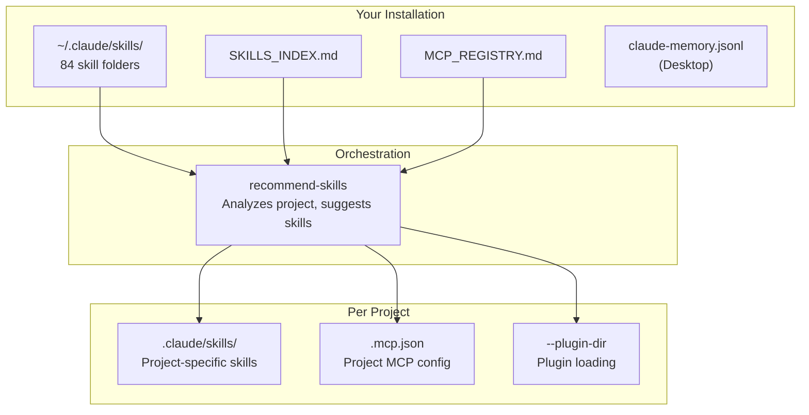
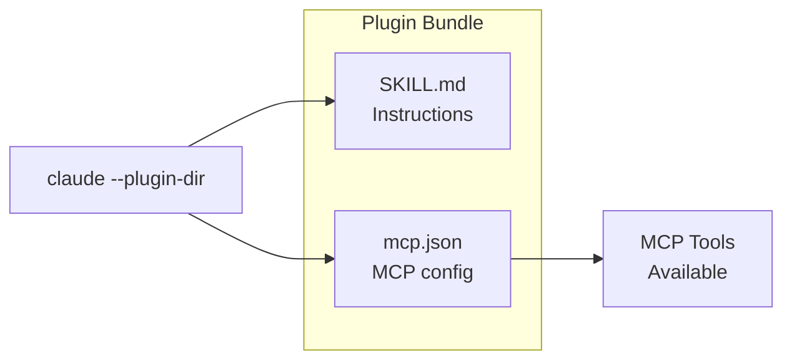

# Global Skills System for Claude Code

> **84 skills + 10 plugins** to supercharge your Claude Code experience.

A curated collection of Claude Code skills for React development, marketing, SEO, CRO, documentation, architecture, and more. Includes MCP integrations via a plugin system for zero-config setup.

---

## What Is This?

**Skills** are markdown instruction files that teach Claude Code specialized behaviors. Instead of explaining what you want every time, skills pre-load expertise for specific domains.

**This collection includes:**
- **84 skills** covering React, marketing, SEO, CRO, documentation, architecture, and utilities
- **10 plugins** that bundle skills with MCP servers for seamless integration
- **Organized index** for easy discovery and project matching
- **Attribution tracking** so you know where each skill came from

---

## System Architecture



---

## Quick Install

### 1. Copy Skills to Global Location

```bash
# Create the skills directory
mkdir -p ~/.claude/skills

# Copy all skills
cp -r skills/* ~/.claude/skills/

# Copy index files
cp SKILLS_INDEX.md MCP_REGISTRY.md ATTRIBUTION.md ~/.claude/
```

### 2. Set Up Memory (Recommended)

```bash
# Add memory MCP globally (only MCP that should be global)
claude mcp add memory --scope user
```

Configure the memory file path to your Desktop for visibility:
- **Windows (WSL):** `/mnt/c/Users/[USERNAME]/Desktop/claude-memory.jsonl`
- **Mac:** `/Users/[USERNAME]/Desktop/claude-memory.jsonl`
- **Linux:** `/home/[USERNAME]/Desktop/claude-memory.jsonl`

### 3. Use Plugins for MCP-Dependent Skills

```bash
# Copy plugins to your project
cp -r plugins/ /path/to/your/project/

# Start Claude with a plugin
claude --plugin-dir ./plugins/react-dev-plugin
```

---

## Skills by Category

| Category | Count | Highlights |
|----------|-------|------------|
| **React/Frontend** | 7 | react-dev, frontend-design, MUI, design systems |
| **Marketing/SEO** | 16 | copywriting, SEO audit, marketing psychology |
| **CRO** | 7 | landing pages, forms, signup flows, A/B testing |
| **Documentation** | 10 | Word, PDF, PowerPoint, spreadsheets, diagrams |
| **Development Workflow** | 8 | session handoff, git commits, QA planning |
| **Database/API** | 4 | schema design, OpenAPI, API handoffs |
| **Architecture** | 6 | C4 diagrams, MCP building, plugins |
| **Communication** | 5 | professional writing, feedback, Jira |
| **Design/Visuals** | 6 | themes, brands, memes, video |
| **Integrations** | 4 | Perplexity, Gemini, Datadog |
| **Utilities** | 8 | humanizer, naming, web testing |
| **Orchestration** | 3 | recommend-skills, index updates |

**Total: 84 skills**

See `SKILLS_INDEX.md` for the complete list with invoke commands.

---

## Plugin System

Plugins bundle a **skill + MCP configuration** together for zero-config setup.



### Available Plugins

| Plugin | Skill | MCP | Purpose |
|--------|-------|-----|---------|
| `react-dev-plugin` | react-dev | context7 | React development with live docs |
| `frontend-design-plugin` | frontend-design | context7 | Frontend architecture with docs |
| `mcp-builder-plugin` | mcp-builder | context7 | Build MCP servers |
| `webapp-testing-plugin` | webapp-testing | playwright | E2E browser testing |
| `video-generator-plugin` | video-generator | remotion | Programmatic video creation |
| `git-workflow-plugin` | commit-work | github | Git commit automation |

### MCP Wrapper Plugins (Direct Access)

| Plugin | MCP | Purpose |
|--------|-----|---------|
| `context7-plugin` | context7 | Pull live docs for any library |
| `playwright-plugin` | playwright | Browser automation |
| `remotion-plugin` | remotion | Video generation |
| `memory-plugin` | memory | Persistent knowledge graph |

### Using Plugins

```bash
# Single plugin
claude --plugin-dir ./plugins/react-dev-plugin

# Multiple plugins
claude --plugin-dir ./plugins/react-dev-plugin --plugin-dir ./plugins/webapp-testing-plugin
```

---

## MCP Requirements

MCPs (Model Context Protocol servers) extend Claude's capabilities. This system uses 5 core MCPs:

| MCP | Package | Purpose | Skills |
|-----|---------|---------|--------|
| **memory** | `@modelcontextprotocol/server-memory` | Persistent knowledge | All projects |
| **context7** | `@upstash/context7-mcp` | Live documentation | react-dev, frontend-design |
| **playwright** | `@anthropic-ai/mcp-server-playwright` | Browser automation | webapp-testing |
| **github** | `@anthropic-ai/mcp-server-github` | Repo operations | commit-work |
| **remotion** | `@anthropic-ai/mcp-server-remotion` | Video generation | video-generator |

**Key Principle:** Configure MCPs per-project (not global) to minimize context overhead. Only the `memory` MCP should be global.

See `MCP_REGISTRY.md` for detailed configuration.

---

## Usage Examples

### Get Skill Recommendations

```
/recommend-skills
```

Claude reads your project files and suggests relevant skills with installation commands.

### Use a Skill Directly

```
/react-dev
```

Invokes the react-dev skill for React development guidance.

### Pull Library Documentation

```
/context7
```

Uses Context7 to fetch live documentation for any library.

### Import a Skill to Your Project

```bash
cp -r ~/.claude/skills/react-dev .claude/skills/
```

---

## Skill Sources & Attribution

| Source | Skills | Focus |
|--------|--------|-------|
| **Anthropic** | 13 | Documents, design, MCP (built-in) |
| **Vercel Labs** | 3 | React, web design |
| **Corey Haines** | 23 | Marketing, SEO, CRO |
| **Softaworks** | 42 | Dev workflow, architecture |
| **Nick Mohler** | 3 | Orchestration, video |

All skills have been reviewed and attributed. See `ATTRIBUTION.md` for details and original repository links.

---

## File Structure

```
~/.claude/
├── skills/                  # All 84 skills
│   ├── react-dev/
│   │   └── SKILL.md
│   ├── copywriting/
│   │   └── SKILL.md
│   └── ... (84 folders)
├── SKILLS_INDEX.md          # Master skill list
├── MCP_REGISTRY.md          # MCP configurations
└── ATTRIBUTION.md           # Skill sources

~/Desktop/
└── claude-memory.jsonl      # Persistent memory (human-readable)

your-project/
├── .claude/skills/          # Project-specific skills
├── .mcp.json                # Project MCP config
└── plugins/                 # Plugin folders
```

---

## Documentation

| Document | Purpose |
|----------|---------|
| `SKILLS_INDEX.md` | Complete skill list with categories and invoke commands |
| `MCP_REGISTRY.md` | MCP configuration snippets and troubleshooting |
| `ATTRIBUTION.md` | Original sources for all skills |
| `docs/QUICKSTART.md` | 5-minute setup guide |
| `docs/PLUGIN-GUIDE.md` | How plugins work |
| `docs/MCP-SETUP-GUIDE.md` | Detailed MCP configuration |
| `docs/ARCHITECTURE.md` | System design deep-dive |
| `SECURITY.md` | Security model and MCP audit |

---

## Security

**Skills are safe** - they're just markdown instruction files that Claude reads.

**MCPs require trust** - they're executable code that runs on your system.

Before installing:
1. Review skill content in `SKILL.md` files
2. Check MCP packages against official npm registries
3. Verify package sources in `SECURITY.md`

See `SECURITY.md` for the complete security model and approved MCP list.

---

## Quick Reference

| Command | Purpose |
|---------|---------|
| `/recommend-skills` | Get skill suggestions for current project |
| `/context7` | Pull live documentation |
| `/react-dev` | React development guidance |
| `claude mcp list` | Show configured MCPs |
| `claude mcp add [name] --scope project` | Add MCP to project |
| `claude --plugin-dir ./plugins/[name]` | Load a plugin |

---

## Credits

Built by **Nick Mohler** using skills from:
- [Anthropic](https://anthropic.com) - Claude Code built-in skills
- [Vercel Labs](https://github.com/vercel-labs) - React best practices
- [Corey Haines / SwipeFiles](https://swipefiles.com) - Marketing and CRO
- [Softaworks](https://github.com/softaworks) - Development workflow

---

## Getting Help

1. Check `docs/QUICKSTART.md` for setup issues
2. Check `MCP_REGISTRY.md` for MCP troubleshooting
3. Run `/recommend-skills` in any project for guidance
