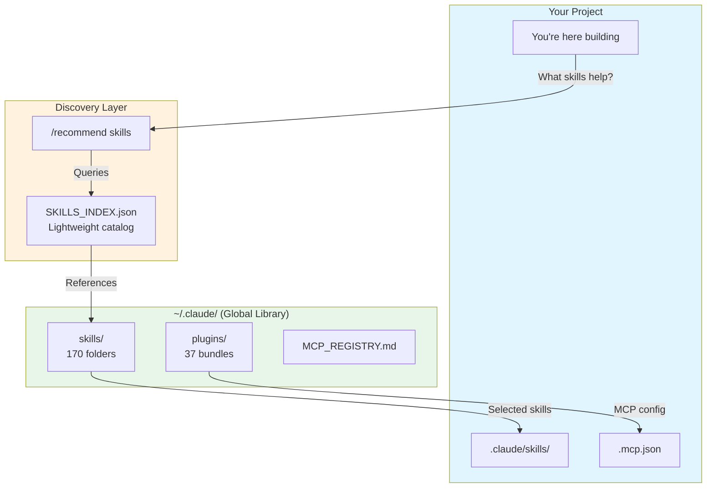
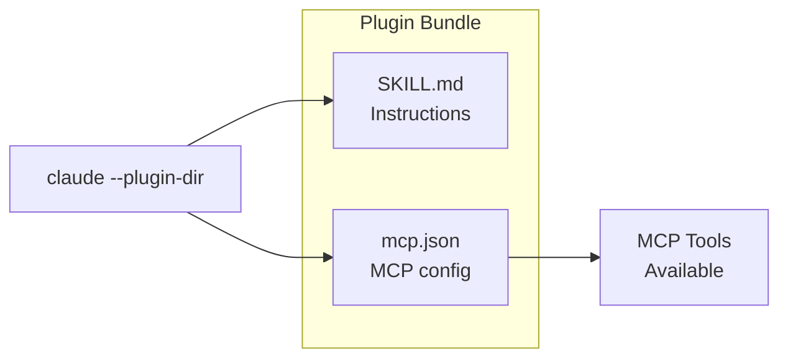

<div align="center">

# Rising Tides Skills Pack

**170 skills + 37 plugins + 9 CLIs + 17 MCPs — Everything you need to supercharge Claude Code.**

[](SECURITY.md)
[](skills/)
[](plugins/)
[](MCP_REGISTRY.md)
[](LICENSE)

*A curated, security-audited collection of Claude Code skills from the open-source community.*

[Quick Install](#one-click-install) | [Skills](#skills-by-category) | [Security](#security) | [Attribution](#attribution)

</div>

---

## What Is This?

**Skills** are markdown instruction files that teach Claude Code specialized behaviors. Instead of explaining what you want every time, skills pre-load expertise for specific domains.

**This collection includes:**
- **170 skills** — Security, React, DevOps, marketing, SEO, architecture, and more
- **37 plugins** — Bundle skills with MCP servers for zero-config setup
- **9 CLI integrations** — GitHub, Stripe, Supabase, Firebase, Vercel, Netlify, Google Cloud
- **17 MCPs** — context7, playwright, github, remotion, memory, and more

---

## How It Works

The Rising Tides system uses **progressive disclosure** — you don't load 170 skills into context. Claude discovers what's available through a lightweight index and loads full skill content only when needed.



**You stay at project level.** You reach UP to the global library when needed, pull DOWN what helps.

### Context Efficiency

| What | Tokens | When Loaded |
|------|--------|-------------|
| Skill descriptions | ~100 per skill | Session start |
| Full SKILL.md content | 500-5000 per skill | On invoke only |
| MCP tool schemas | ~500 total | On-demand (with Tool Search) |

**You're paying ~6% context for 170 skills.** Full content loads only when you invoke a skill.

---

## One-Click Install

**New to Claude Code?** Use our starter pack for automated setup:

### Mac
```bash
curl -fsSL https://raw.githubusercontent.com/SunsetSystemsAI/rising-tides-starter/main/scripts/setup-mac.sh -o /tmp/setup.sh && bash /tmp/setup.sh
```

> **Do NOT use `sudo`.** The script will ask for your password when needed.

### Windows (PowerShell as Admin)
```powershell
Set-ExecutionPolicy Bypass -Scope Process -Force
[Net.ServicePointManager]::SecurityProtocol = [Net.SecurityProtocolType]::Tls12
Invoke-WebRequest -Uri 'https://raw.githubusercontent.com/SunsetSystemsAI/rising-tides-starter/main/scripts/setup-windows.ps1' -OutFile "$env:TEMP\setup-windows.ps1"
& "$env:TEMP\setup-windows.ps1"
```

### Linux / WSL2
```bash
curl -fsSL https://raw.githubusercontent.com/SunsetSystemsAI/rising-tides-starter/main/scripts/setup-linux.sh -o /tmp/setup.sh && bash /tmp/setup.sh
```

This installs Node.js, Git, Claude Code, and the full skills pack automatically.

---

## Manual Install

### 1. Copy Skills to Global Location

```bash
# Create and copy skills
mkdir -p ~/.claude/skills
cp -r skills/* ~/.claude/skills/

# Copy index files
cp SKILLS_INDEX.json MCP_REGISTRY.md ATTRIBUTION.md ~/.claude/
```

### 2. Copy Plugins

```bash
mkdir -p ~/.claude/plugins
cp -r plugins/* ~/.claude/plugins/
```

### 3. Enable Tool Search

```bash
# Add to your shell profile (.bashrc, .zshrc, etc.)
export ENABLE_TOOL_SEARCH=true
```

> **Use `true` not `auto`** — auto mode has a known bug where it fails to trigger.

### 4. Set Up Memory (Recommended)

```bash
claude mcp add memory --scope user
```

---

## Skills by Category

| Category | Skills | Highlights |
|----------|--------|------------|
| **Security** | 24 | Auditing, YARA rules, Semgrep, smart contracts, OWASP patterns |
| **Frontend** | 18 | React, Vue, Angular, TypeScript, design systems |
| **Backend** | 22 | Django, FastAPI, Spring Boot, NestJS, Rails, Laravel |
| **DevOps** | 15 | Kubernetes, Terraform, Docker, CI/CD, GitOps |
| **Marketing** | 23 | Copywriting, SEO, CRO, analytics, email sequences |
| **Architecture** | 12 | C4 diagrams, API design, microservices, cloud |
| **Documentation** | 11 | READMEs, Mermaid, presentations, Office docs |
| **Workflow** | 14 | Git, debugging, handoffs, requirements |
| **Languages** | 31+ | Python, Go, Rust, C++, Java, Kotlin, Swift |

**Total: 170 skills**

See `SKILLS_INDEX.json` for the complete list with invoke commands.

---

## Plugin System

Plugins bundle a **skill + MCP configuration** for zero-config setup.



### Key Plugins

| Plugin | Skill | MCP | Purpose |
|--------|-------|-----|---------|
| `react-dev-plugin` | react-dev | context7 | React with live docs |
| `frontend-ui-plugin` | frontend-ui | context7 + shadcn | Full frontend stack |
| `webapp-testing-plugin` | webapp-testing | playwright | E2E browser testing |
| `browser-automation-plugin` | browser-automation | claude-in-chrome | Chrome automation |
| `video-generator-plugin` | video-generator | remotion | Programmatic video |
| `git-workflow-plugin` | commit-work | github | Git commit automation |

### Using Plugins

**Via /recommend skills (recommended):**
```
/recommend skills
```
Skills copy to `.claude/skills/`, MCP configs merge into `.mcp.json`.

**Manual:**
```bash
claude --plugin-dir ~/.claude/plugins/react-dev-plugin
```

---

## Security

<div align="center">

### Security Audit Status: PASSED

</div>

Every skill and script has been security audited.

| Metric | Result |
|--------|--------|
| Files Scanned | 1,012+ |
| Critical Issues | 0 |
| High Issues | 0 (2 fixed) |
| Medium Issues | 3 (documented) |
| Community Repos Audited | 16 (10 approved, 6 rejected) |

### What We Checked

| Check | Result |
|-------|--------|
| Hardcoded API keys | ✅ None found |
| Malicious URLs | ✅ All official sources |
| Data exfiltration | ✅ None found |
| Command injection | ✅ Fixed |
| MCP over-permissions | ✅ Minimal permissions |

**Skills are safe** — they're markdown files you can read and audit.

**MCPs require trust** — we only include MCPs from verified publishers (Anthropic, Upstash).

See [SECURITY.md](SECURITY.md) for the full audit report.

---

## Attribution

<div align="center">

### Standing on the Shoulders of Giants

*This collection curates skills from the open-source community. All credit goes to the original authors.*

</div>

| Source | Skills | Focus | License |
|--------|--------|-------|---------|
| **[Trail of Bits](https://github.com/trailofbits/skills)** | 24 | Security auditing, YARA, Semgrep | Apache-2.0 |
| **[Corey Haines](https://github.com/coreyhaines31/marketingskills)** | 23 | Marketing, SEO, CRO | MIT |
| **[Jeff Allan](https://github.com/Jeffallan/claude-skills)** | 60+ | Languages, frameworks | MIT |
| **[Softaworks](https://github.com/softaworks/agent-toolkit)** | 40 | Dev workflow, architecture | MIT |
| **[harperaa](https://github.com/harperaa/secure-claude-skills)** | 11 | Next.js security (OWASP) | MIT |
| **[Vercel Labs](https://github.com/vercel-labs/agent-skills)** | 3 | React, web design | MIT |
| **[Ahmed Asmar](https://github.com/ahmedasmar/devops-claude-skills)** | 6 | DevOps, SRE | MIT |
| **[Chris Wiles](https://github.com/ChrisWiles/claude-code-showcase)** | 5 | Claude Code patterns | MIT |
| **[rknall](https://github.com/rknall/claude-skills)** | 6 | Docker, GitLab | MIT |
| **[Anton Babenko](https://github.com/antonbabenko/terraform-skill)** | 1 | Terraform IaC | Apache-2.0 |
| **[obra/superpowers](https://github.com/obra/superpowers)** | 1 | Debugging methodology | MIT |
| **[lackeyjb](https://github.com/lackeyjb/playwright-skill)** | 1 | Playwright testing | MIT |
| **Anthropic** | 13 | Built-in Claude Code skills | Apache-2.0 |

See [ATTRIBUTION.md](ATTRIBUTION.md) for the complete list.

---

## Usage Examples

### Get Recommendations
```
/recommend skills
```
Claude analyzes your project and suggests relevant skills.

### Direct Invocation
```
/react-dev create a login form component
/security-audit check this codebase
/copywriting write a headline for my app
```

### With Plugins
```bash
claude --plugin-dir ~/.claude/plugins/react-dev-plugin
```

---

## File Structure

```
~/.claude/                          # GLOBAL LIBRARY
├── skills/                         # All 170 skills
│   ├── react-dev/
│   │   └── SKILL.md
│   ├── security-audit/
│   │   └── SKILL.md
│   └── ... (170 folders)
├── plugins/                        # Plugin bundles
│   └── ... (37 folders)
├── SKILLS_INDEX.json               # Master catalog
├── MCP_REGISTRY.md                 # MCP configs
└── ATTRIBUTION.md                  # Credits

your-project/                       # PROJECT LEVEL
├── .claude/skills/                 # Pulled from global
└── .mcp.json                       # Project MCP config
```

---

## Documentation

| Document | Purpose |
|----------|---------|
| [SKILLS_INDEX.json](SKILLS_INDEX.json) | Complete skill list |
| [MCP_REGISTRY.md](MCP_REGISTRY.md) | MCP configuration |
| [ATTRIBUTION.md](ATTRIBUTION.md) | Original sources |
| [SECURITY.md](SECURITY.md) | Security audit |
| [docs/QUICKSTART.md](docs/QUICKSTART.md) | 5-minute setup |
| [docs/PLUGIN-GUIDE.md](docs/PLUGIN-GUIDE.md) | Plugin system |

---

## Community & Support

<div align="center">

[](https://www.skool.com/rising-tides-9034)
[](https://github.com/SunsetSystemsAI/rising-tides-pack/issues)
[](https://github.com/SunsetSystemsAI/rising-tides-starter)

</div>

---

## License

This curation is MIT licensed. Individual skills retain their original licenses (MIT or Apache-2.0).

See [ATTRIBUTION.md](ATTRIBUTION.md) for per-skill license information.

---

<div align="center">

**A Rising Tide Lifts All Boats**

</div>
