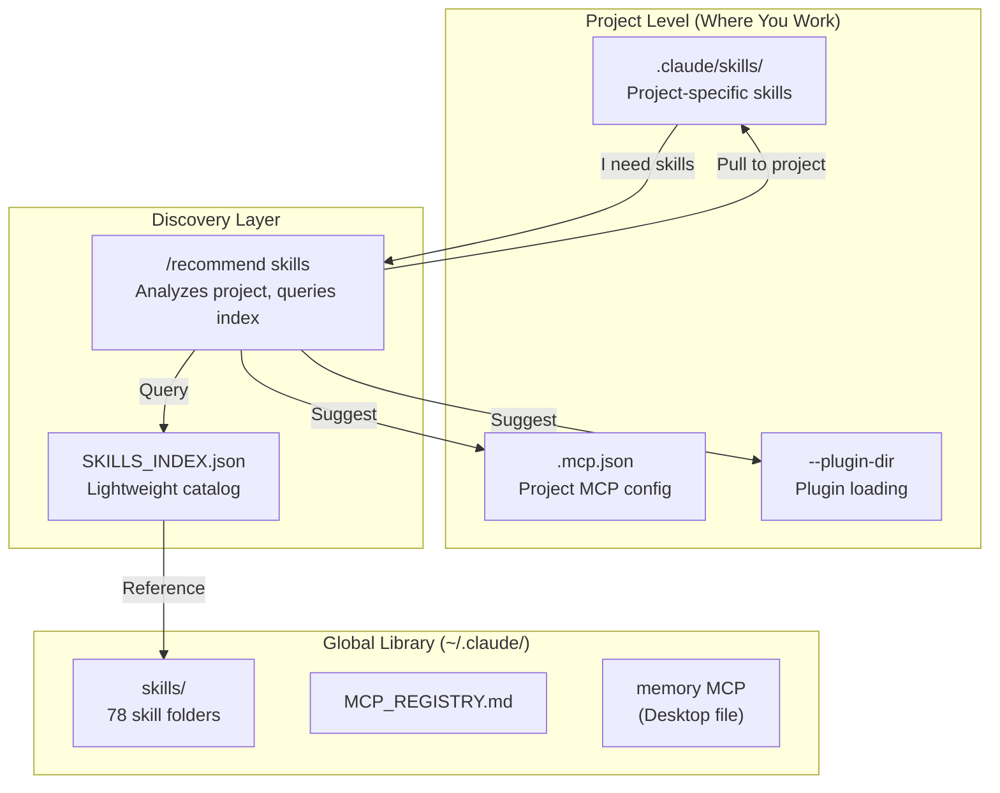
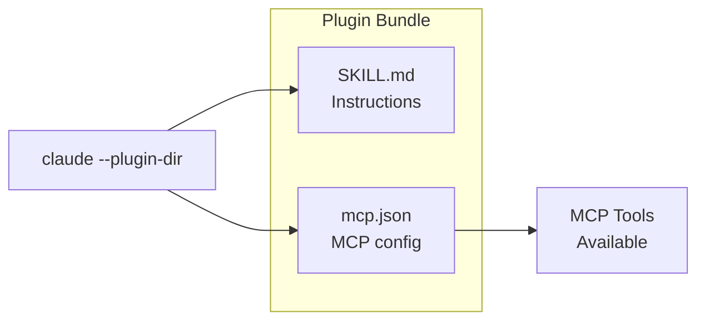

# Rising Tides Skills Pack

> **78 skills + 12 plugins + 9 CLI integrations + 8 MCPs** — everything you need to supercharge Claude Code.

A curated collection of Claude Code skills for React development, marketing, SEO, CRO, documentation, architecture, CLI integrations, and more. Includes MCP integrations via a plugin system for zero-config setup.

---

## How It Works

The Rising Tides system uses **progressive disclosure** — you don't load 78 skills into context. Instead, Claude discovers what's available through a lightweight index and loads full skill content only when needed.

### The Flow: Project-Level Up

```
┌─────────────────────────────────────────────────────────────────┐
│                      YOUR PROJECT                                │
│  You're here, building something. You have a plan.              │
│  .claude/skills/ ← Skills get pulled here                       │
└─────────────────────────────────────────────────────────────────┘
         │                                           ▲
         │ "What skills would help?"                 │ Selected skills
         ▼                                           │ pulled down
┌─────────────────────────────────────────────────────────────────┐
│                    /recommend skills                             │
│  The bridge between your project and the global library         │
│  Analyzes your project → Queries index → Shows recommendations  │
└─────────────────────────────────────────────────────────────────┘
         │                                           │
         │ Queries                                   │
         ▼                                           │
┌─────────────────────────────────────────────────────────────────┐
│                    SKILLS_INDEX.json                             │
│  Lightweight catalog: names, triggers, cli/mcp refs             │
│  Fast discovery without loading 78 SKILL.md files               │
└─────────────────────────────────────────────────────────────────┘
         │                                           │
         │ References                                │
         ▼                                           │
┌─────────────────────────────────────────────────────────────────┐
│                    GLOBAL SKILLS REPO                            │
│  ~/.claude/skills/ — all 78 skill folders                       │
│  plugins/ — 12 MCP bundles                                      │
│  Source of truth. User reaches up to access.                    │
└─────────────────────────────────────────────────────────────────┘
```

### The Mental Model

- **Global repo** = Library of available skills (this repo, installed to `~/.claude/`)
- **SKILLS_INDEX.json** = The catalog (fast discovery)
- **/recommend skills** = The librarian (helps you find what you need)
- **Project level** = Your workspace (where skills get used)

**You stay at project level.** You reach UP to the global library when needed, pull DOWN what helps.

---

## Architecture Overview

```
┌─────────────────────────────────────────────────────────────┐
│                        PLUGINS (12)                          │
│  Bundle everything: Skill + MCP + CLI reference              │
│  Load with: claude --plugin-dir ./plugins/[name]            │
└─────────────────────────────────────────────────────────────┘
                              │
        ┌─────────────────────┼─────────────────────┐
        ▼                     ▼                     ▼
┌───────────────┐    ┌───────────────┐    ┌───────────────┐
│  SKILLS (78)  │    │   MCPs (8)    │    │   CLIs (9)    │
│  Knowledge &  │    │  Rich API     │    │  Auth &       │
│  workflows    │    │  operations   │    │  simple ops   │
│               │    │               │    │               │
│  Markdown-    │    │  context7     │    │  gh, stripe   │
│  based        │    │  playwright   │    │  vercel...    │
└───────────────┘    └───────────────┘    └───────────────┘
```

---

## One-Click Install

**New to Claude Code?** Use our starter pack for automated setup:

### Mac
```bash
curl -fsSL https://raw.githubusercontent.com/TinyShaft22/rising-tides-starter/main/scripts/setup-mac.sh -o /tmp/setup.sh && bash /tmp/setup.sh
```

> **Do NOT use `sudo`.** The script will ask for your password when it needs admin access.

### Windows (PowerShell as Admin)
```powershell
Set-ExecutionPolicy Bypass -Scope Process -Force
[Net.ServicePointManager]::SecurityProtocol = [Net.SecurityProtocolType]::Tls12
Invoke-WebRequest -Uri 'https://raw.githubusercontent.com/TinyShaft22/rising-tides-starter/main/scripts/setup-windows.ps1' -OutFile "$env:TEMP\setup-windows.ps1"
& "$env:TEMP\setup-windows.ps1"
```

### Linux / WSL2
```bash
curl -fsSL https://raw.githubusercontent.com/TinyShaft22/rising-tides-starter/main/scripts/setup-linux.sh -o /tmp/setup.sh && bash /tmp/setup.sh
```

This installs Node.js, Git, Claude Code, and the full skills pack automatically.

---

## What Is This?

**Skills** are markdown instruction files that teach Claude Code specialized behaviors. Instead of explaining what you want every time, skills pre-load expertise for specific domains.

**This collection includes:**
- **78 skills** covering React, marketing, SEO, CRO, documentation, architecture, CLI integrations, and utilities
- **12 plugins** that bundle skills with MCP servers for seamless integration
- **CLI-first approach** for GitHub, Stripe, Supabase, Firebase, Vercel, Netlify, and Google Cloud
- **Organized index** (`SKILLS_INDEX.json`) for fast discovery without loading all skills
- **Attribution tracking** so you know where each skill came from

---

## Context Efficiency (Tested & Proven)

**The big question:** Won't 78 skills bloat my context window?

**Answer:** No. We tested it. Here's the proof:

### Test Results (January 2026)

| Condition | Total Context | Skills Category | Notes |
|-----------|---------------|-----------------|-------|
| **Without skills** | 29k (14%) | 548 tokens | Baseline |
| **With 78 skills** | 32k (16%) | 7.9k tokens | +7.35k for skills |
| **After /recommend skills** | 51k (25%) | 7.9k tokens | Skills unchanged |
| **After invoking skill** | 75k (38%) | 7.9k tokens | Skills still unchanged |

### What This Proves

1. **Fixed overhead:** 78 skills cost only **~8k tokens** (~4% of context)
2. **Frontmatter only:** That's ~100 tokens per skill (just triggers/descriptions)
3. **On-demand loading:** Full skill content loads into Messages when invoked, not Skills
4. **Index-based recommendations:** `/recommend skills` reads the lightweight index, not all 78 SKILL.md files

### The Math

| What | Tokens | When Loaded |
|------|--------|-------------|
| Skill frontmatter (triggers) | ~100 per skill | Session start (fixed) |
| Full SKILL.md content | 500-2000 per skill | On invoke only |
| Reference files | 200-1000 each | On invoke only |

**You're paying ~4% context for 78 skills.** Full content would cost 50-100x more.

### How It Works

```
Session Start
    ↓
Load 78 skill frontmatter (~8k fixed)
    ↓
User asks question
    ↓
Claude matches to skill trigger
    ↓
Read SKILL.md + references on-demand → goes to Messages
    ↓
Execute with full expertise
```

---

## System Architecture



---

## Quick Install

### 1. Copy Skills to Global Location

```bash
# Create the skills directory
mkdir -p ~/.claude/skills

# Copy all skills
cp -r skills/* ~/.claude/skills/

# Copy index files
cp SKILLS_INDEX.json MCP_REGISTRY.md ATTRIBUTION.md ~/.claude/
```

### 2. Copy Plugins to Global Location

```bash
# Create plugins directory and copy all plugins
mkdir -p ~/.claude/plugins
cp -r plugins/* ~/.claude/plugins/
```

This installs 12 plugin bundles that pair skills with MCP servers (context7, playwright, etc.).

### 3. Set Up Memory (Recommended)

```bash
# Add memory MCP globally (only MCP that should be global)
claude mcp add memory --scope user
```

Configure the memory file path to your Desktop for visibility:
- **Windows (WSL):** `/mnt/c/Users/[USERNAME]/Desktop/claude-memory.jsonl`
- **Mac:** `/Users/[USERNAME]/Desktop/claude-memory.jsonl`
- **Linux:** `/home/[USERNAME]/Desktop/claude-memory.jsonl`

### 4. Enable Tool Search (Recommended)

For optimal context efficiency with MCPs:

```bash
# Add to your shell profile (.bashrc, .zshrc, etc.)
export ENABLE_TOOL_SEARCH=auto
```

This defers MCP schema loading until tools are actually used (~500 tokens on-demand vs ~20k+ upfront).

### 5. Let /recommend-skills Configure MCPs

When you run `/recommend skills` in a project and confirm plugin imports, the skill will:
1. Copy skill files to `.claude/skills/`
2. Create/merge MCP configs into project's `.mcp.json`
3. MCPs auto-load when you restart Claude

**No `--plugin-dir` flags needed!**

**Alternative: Manual Plugin Loading**

You can still use `--plugin-dir` for manual control:
```bash
claude --plugin-dir ~/.claude/plugins/react-dev-plugin
```

---

## Skills by Category

| Category | Count | Highlights |
|----------|-------|------------|
| **React/Frontend** | 7 | react-dev, frontend-design, MUI, design systems |
| **Marketing/SEO** | 16 | copywriting, SEO audit, marketing psychology |
| **CRO** | 7 | landing pages, forms, signup flows, A/B testing |
| **Documentation** | 10 | Word, PDF, PowerPoint, spreadsheets, diagrams |
| **GitHub & Version Control** | 2 | github-workflow, commit-work |
| **Debugging** | 1 | systematic-debugging (4-phase root cause) |
| **Database/API** | 5 | drizzle-orm, schema design, OpenAPI, API handoffs |
| **Payments** | 1 | stripe-integration (Stripe CLI) |
| **Backend Services** | 2 | supabase-guide, firebase-guide |
| **Deployment** | 3 | vercel-deployment, netlify-deployment, google-cloud-setup |
| **Auth & Security** | 2 | oauth-setup, skill-safety-check |
| **SaaS Starters** | 1 | saas-starter-setup (one-shot scaffolding) |
| **Architecture** | 6 | C4 diagrams, MCP building, plugins |
| **Communication** | 5 | professional writing, feedback, Jira |
| **Design/Visuals** | 6 | themes, brands, memes, video |
| **Development Workflow** | 7 | session handoff, QA planning |
| **Integrations** | 4 | Perplexity, Gemini, Datadog |
| **Utilities** | 7 | humanizer, naming, web testing |
| **Orchestration** | 3 | recommend-skills, index updates |

**Total: 78 skills**

See `SKILLS_INDEX.json` for the complete list with invoke commands.

---

## Plugin System

Plugins bundle a **skill + MCP configuration** together for zero-config setup.



### Available Plugins

| Plugin | Skill | MCP | Purpose |
|--------|-------|-----|---------|
| `react-dev-plugin` | react-dev | context7 | React development with live docs |
| `frontend-design-plugin` | frontend-design | context7 | Frontend architecture with docs |
| `frontend-ui-plugin` | frontend-ui | context7 + shadcn | Full frontend with component registry |
| `mcp-builder-plugin` | mcp-builder | context7 | Build MCP servers |
| `webapp-testing-plugin` | webapp-testing | playwright | E2E browser testing |
| `browser-automation-plugin` | browser-automation | claude-in-chrome | Chrome automation, screenshots, forms |
| `video-generator-plugin` | video-generator | remotion | Programmatic video creation |
| `git-workflow-plugin` | commit-work | github | Git commit automation |

### MCP Wrapper Plugins (Direct Access)

| Plugin | MCP | Purpose |
|--------|-----|---------|
| `context7-plugin` | context7 | Pull live docs for any library |
| `playwright-plugin` | playwright | Browser automation |
| `remotion-plugin` | remotion | Video generation |
| `memory-plugin` | memory | Persistent knowledge graph |

### Using Plugins

**Recommended: Via /recommend-skills**

Run `/recommend skills` in your project. When you confirm plugin imports:
- Skills copy to `.claude/skills/`
- MCP configs merge into `.mcp.json`
- MCPs auto-load on Claude restart

**Alternative: Manual --plugin-dir**

```bash
# Single plugin
claude --plugin-dir ./plugins/react-dev-plugin

# Multiple plugins
claude --plugin-dir ./plugins/react-dev-plugin --plugin-dir ./plugins/webapp-testing-plugin
```

---

## MCP Requirements

MCPs (Model Context Protocol servers) extend Claude's capabilities. This system uses 5 core MCPs:

| MCP | Package | Purpose | Skills |
|-----|---------|---------|--------|
| **memory** | `@modelcontextprotocol/server-memory` | Persistent knowledge | All projects |
| **context7** | `@upstash/context7-mcp` | Live documentation | react-dev, frontend-design |
| **playwright** | `@playwright/mcp` | Browser automation | webapp-testing |
| **github** | `@anthropic-ai/mcp-server-github` | Repo operations | commit-work |
| **remotion** | `@anthropic-ai/mcp-server-remotion` | Video generation | video-generator |

**Key Principle:** Configure MCPs per-project (not global) to minimize context overhead. Only the `memory` MCP should be global.

See `MCP_REGISTRY.md` for detailed configuration.

---

## Usage Examples

### Step 1: Get Skill Recommendations

When you're in a project and want to know which skills would help:

```
/recommend skills
```

Claude reads your project context (planning docs, README, structure) and:
- Shows which skills to **IMPORT** (directly relevant)
- Shows which skills to **SKIP** (not relevant, with reasons)
- Recommends plugins for MCP-dependent skills

### Step 2: Pull Skills to Your Project

After reviewing recommendations, import the skills you need:

```bash
cp -r ~/.claude/skills/react-dev .claude/skills/
```

### Step 3: Use Skills Automatically

Once skills are at project level, Claude auto-invokes them based on triggers:

```
Help me build a React component with authentication
```

Claude matches "React component" → invokes `react-dev` skill automatically.

### Direct Skill Invocation

You can also invoke skills directly:

```
/react-dev       # React development guidance
/context7        # Pull live library documentation
/stripe-integration  # Stripe payments setup
```

---

## Skill Sources & Attribution

| Source | Skills | Focus |
|--------|--------|-------|
| **Anthropic** | 13 | Documents, design, MCP (built-in) |
| **Vercel Labs** | 3 | React, web design |
| **Corey Haines** | 23 | Marketing, SEO, CRO |
| **Softaworks** | 40 | Dev workflow, architecture |
| **Nick Mohler** | 15 | Orchestration, video, CLI integrations |
| **obra/superpowers** | 1 | Debugging methodology |

All skills have been reviewed and attributed. See `ATTRIBUTION.md` for details and original repository links.

---

## File Structure

```
~/.claude/                          # GLOBAL LIBRARY
├── skills/                         # All 78 skills
│   ├── react-dev/
│   │   └── SKILL.md
│   ├── copywriting/
│   │   └── SKILL.md
│   └── ... (78 folders)
├── SKILLS_INDEX.json               # Master skill catalog
├── MCP_REGISTRY.md                 # MCP configurations
└── ATTRIBUTION.md                  # Skill sources

~/Desktop/
└── claude-memory.jsonl             # Persistent memory (human-readable)

your-project/                       # PROJECT LEVEL (where you work)
├── .claude/skills/                 # Skills pulled from global
├── .mcp.json                       # Project MCP config
└── plugins/                        # Plugin folders (if using)
```

---

## Documentation

| Document | Purpose |
|----------|---------|
| `SKILLS_INDEX.json` | Complete skill list with categories and invoke commands |
| `MCP_REGISTRY.md` | MCP configuration snippets and troubleshooting |
| `ATTRIBUTION.md` | Original sources for all skills |
| `docs/QUICKSTART.md` | 5-minute setup guide |
| `docs/PLUGIN-GUIDE.md` | How plugins work |
| `docs/MCP-SETUP-GUIDE.md` | Detailed MCP configuration |
| `docs/ARCHITECTURE.md` | System design deep-dive |
| `docs/rising-tides-flow.excalidraw` | Architecture diagram (import into excalidraw.com) |
| `SECURITY.md` | Security model and MCP audit |

---

## Security

**Skills are safe** - they're just markdown instruction files that Claude reads.

**MCPs require trust** - they're executable code that runs on your system.

Before installing:
1. Review skill content in `SKILL.md` files
2. Check MCP packages against official npm registries
3. Verify package sources in `SECURITY.md`

See `SECURITY.md` for the complete security model and approved MCP list.

---

## Quick Reference

| Command | Purpose |
|---------|---------|
| `/recommend skills` | Get skill suggestions for current project |
| `/github-workflow` | Full GitHub lifecycle with gh CLI |
| `/stripe-integration` | Stripe payments setup |
| `/saas-starter-setup` | One-shot SaaS scaffolding |
| `/systematic-debugging` | 4-phase root cause debugging |
| `/context7` | Pull live documentation |
| `/react-dev` | React development guidance |
| `claude mcp list` | Show configured MCPs |
| `claude mcp add [name] --scope project` | Add MCP to project |
| `claude --plugin-dir ./plugins/[name]` | Load a plugin |

---

## Credits

Built by **Nick Mohler** using skills from:
- [Anthropic](https://github.com/anthropics/skills) - Claude Code built-in skills (Apache 2.0)
- [Vercel Labs](https://github.com/vercel-labs/agent-skills) - React best practices (MIT)
- [Corey Haines](https://github.com/coreyhaines31/marketingskills) - Marketing and CRO (MIT)
- [Softaworks](https://github.com/softaworks/agent-toolkit) - Development workflow (MIT)
- [obra/superpowers](https://github.com/obra/superpowers) - Debugging methodology (MIT)

All curated skills use permissive open-source licenses (MIT/Apache 2.0). See `ATTRIBUTION.md` for full details.

---

## Community & Support

- **Community:** [Rising Tides on Skool](https://www.skool.com/rising-tides-9034) — Get help, share wins
- **Issues:** [GitHub Issues](https://github.com/TinyShaft22/rising-tides-pack/issues)
- **Starter Pack:** [rising-tides-starter](https://github.com/TinyShaft22/rising-tides-starter)

---

## Getting Help

1. **Join the community:** [skool.com/rising-tides](https://www.skool.com/rising-tides-9034)
2. Check `docs/QUICKSTART.md` for setup issues
3. Check `MCP_REGISTRY.md` for MCP troubleshooting
4. Run `/recommend skills` in any project for guidance

---

## License

This curation is MIT licensed. Individual skills retain their original licenses (all MIT or Apache 2.0). See `ATTRIBUTION.md` for details.
