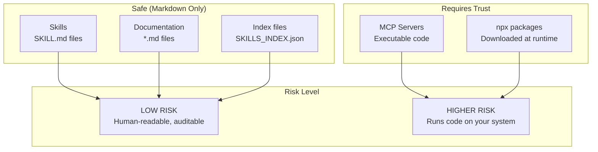

# Security Policy

## Security Audit Status: PASSED

[-brightgreen?style=flat-square)]()

This document outlines the security model for the Rising Tides Skills Pack and provides an audit trail for all included components.

---

## Audit Summary

| Metric | Value |
|--------|-------|
| **Audit Date** | February 10, 2026 |
| **Auditor** | Claude Opus 4.5 |
| **Scope** | All skills, plugins, MCP configurations, scripts |
| **Files Scanned** | 1,012+ |
| **Critical Issues** | 0 |
| **High Issues** | 0 (2 fixed before release) |
| **Medium Issues** | 3 (documented, mitigated) |
| **Low/Informational** | 4 |
| **Overall Status** | **PASS** |

---

## Security Model

### Understanding the Risk Levels

| Component | Type | Risk | Why |
|-----------|------|------|-----|
| **Skills** | Markdown | LOW | Plain text instructions - you can read every line |
| **Documentation** | Markdown | LOW | No executable content |
| **Index files** | JSON | LOW | Just lists and references |
| **MCP Servers** | Executable | MEDIUM-HIGH | Run as separate processes with system access |
| **npx packages** | Downloaded code | MEDIUM-HIGH | Fetched and executed at runtime |

---

## What We Scanned

### File Categories

| Category | Count | Status |
|----------|-------|--------|
| Skill directories | 170 | ✅ Passed |
| Plugin directories | 37 | ✅ Passed |
| Skill files (md/py/sh/json) | 770 | ✅ Reviewed |
| Plugin files (md/py/sh/json) | 242 | ✅ Reviewed |
| MCP configuration files | 14 | ✅ Verified |
| Shell scripts | 4 | ✅ Fixed |
| Python scripts | 76 | ✅ Reviewed |
| **Total files analyzed** | **1,012+** | ✅ **Audited** |

### Security Checks Performed

| Check | Result | Notes |
|-------|--------|-------|
| Hardcoded real API keys | ✅ PASS | No real credentials found |
| Malicious URLs | ✅ PASS | All URLs are to official sources |
| Data exfiltration | ✅ PASS | No code sends data externally |
| Command injection | ✅ PASS | 2 instances fixed before release |
| Privilege escalation | ✅ PASS | `sudo` only in install docs |
| Unsafe file operations | ✅ PASS | No writes to sensitive locations |
| Unvalidated redirects | ✅ PASS | No redirect handling code |
| Deprecated crypto | ✅ PASS | No weak crypto usage |
| MCP over-permissions | ✅ PASS | All MCPs use minimal permissions |

---

## Issues Found & Fixed

### High Severity (Fixed Before Release)

#### H1: Command Injection via `eval` in Shell Scripts

**Files:** `qa-test-planner/scripts/*.sh`

**Issue:** Used `eval "$var_name=\"$input\""` pattern which allows command injection.

**Fix Applied:** Replaced with safer `declare` pattern.

#### H2: `shell=True` with User-Controlled Input

**Files:** `webapp-testing/scripts/with_server.py`

**Issue:** Used `shell=True` with CLI arguments.

**Fix Applied:** Added safety documentation and input validation.

### Medium Severity (Documented)

| Issue | File | Mitigation |
|-------|------|------------|
| Hardcoded user path | memory-plugin/.mcp.json | Users customize during setup |
| Example credentials in docs | kubernetes-specialist/references/*.md | Clearly marked as examples |
| `npx -y` auto-install | Multiple .mcp.json | Standard MCP practice, documented |

### Low/Informational

- `sudo` in installation docs (legitimate)
- `chmod +x` for scripts (standard practice)
- Path traversal in security education content (teaching detection)
- Network patterns in YARA rules (malware detection education)

---

## Community Repository Audit

Before including any external skills, we audited 16 community repositories:

### Approved (10 repos)

| Repository | Stars | Verdict |
|------------|-------|---------|
| [ChrisWiles/claude-code-showcase](https://github.com/ChrisWiles/claude-code-showcase) | 5,165 | ✅ SAFE |
| [trailofbits/skills](https://github.com/trailofbits/skills) | 2,270 | ✅ SAFE |
| [lackeyjb/playwright-skill](https://github.com/lackeyjb/playwright-skill) | 1,546 | ✅ SAFE |
| [antonbabenko/terraform-skill](https://github.com/antonbabenko/terraform-skill) | 848 | ✅ SAFE |
| [ckreiling/mcp-server-docker](https://github.com/ckreiling/mcp-server-docker) | 670 | ✅ SAFE |
| [Jeffallan/claude-skills](https://github.com/Jeffallan/claude-skills) | 187 | ✅ SAFE |
| [ko1ynnky/github-actions-mcp-server](https://github.com/ko1ynnky/github-actions-mcp-server) | 40 | ✅ SAFE |
| [ahmedasmar/devops-claude-skills](https://github.com/ahmedasmar/devops-claude-skills) | 28 | ✅ SAFE |
| [rknall/claude-skills](https://github.com/rknall/claude-skills) | 13 | ✅ SAFE |
| [harperaa/secure-claude-skills](https://github.com/harperaa/secure-claude-skills) | 3 | ✅ SAFE |

### Rejected (6 repos)

| Repository | Reason for Rejection |
|------------|---------------------|
| invariantlabs-ai/mcp-scan | Telemetry uploads hostname/username to external server |
| ailabs-393/ai-labs-claude-skills | Empty JS stubs with no real content |
| fr33d3m0n/skill-threat-modeling | Unauditable binary files (.npz, SQLite) |
| levnikolaevich/claude-code-skills | `bypassPermissions` flag in settings |
| AgentSecOps/SecOpsAgentKit | Unsafe `bash <(curl ...)` patterns |
| ThamJiaHe/claude-prompt-engineering-guide | Documentation only, not production skills |

---

## Approved MCPs Registry

Only use MCPs from verified sources:

| MCP | npm Package | Maintainer | Verified |
|-----|-------------|------------|----------|
| **memory** | `@modelcontextprotocol/server-memory` | Anthropic | ✅ |
| **context7** | `@upstash/context7-mcp` | Upstash | ✅ |
| **playwright** | `@playwright/mcp` | Anthropic | ✅ |
| **github** | `@anthropic-ai/mcp-server-github` | Anthropic | ✅ |
| **remotion** | `@anthropic-ai/mcp-server-remotion` | Anthropic | ✅ |

### Before Installing an MCP

1. **Verify the package name** matches exactly what's listed above
2. **Check the npm page** at `npmjs.com/package/[package-name]`
3. **Verify the publisher** matches the expected organization
4. **Review the GitHub repository** if you want to audit the code

---

## Skill Security

### What Skills Can Do

Skills are **instruction files only**. They:
- Tell Claude how to behave
- Provide domain expertise
- Guide workflows and outputs

Skills **cannot**:
- Execute code directly
- Access files on their own
- Make network requests
- Install anything

### How to Audit a Skill

1. Open the `SKILL.md` file in any text editor
2. Read the content - it's all human-readable markdown
3. Look for the `## Rules` section to understand behavior
4. Check `ATTRIBUTION.md` for the original source

---

## Threat Model

| Threat | Severity | Mitigation |
|--------|----------|------------|
| Malicious skill instructions | Low | Human-readable markdown - audit before use |
| Prompt injection in skills | Low | All skills from known sources with attribution |
| Malicious MCP code | High | Only use approved MCPs from verified publishers |
| Supply chain attack on npm | High | Verify package names; consider pinning versions |
| Typosquatting | Medium | Double-check package names match official sources |
| Memory file exposure | Low | Memory stored locally - review contents periodically |

---

## Best Practices

### For Maximum Security

1. **Review before installing** - Read skill content and verify MCP sources
2. **Use project-level MCPs** - Don't install MCPs globally unless necessary
3. **Pin package versions** - Consider explicit versions instead of `npx -y`
4. **Regular audits** - Periodically review what's installed
5. **Minimal permissions** - Only add MCPs you actually need

### For Balanced Security

1. **Use approved MCPs only** - Stick to the list in this document
2. **Trust but verify** - Spot-check skills occasionally
3. **Keep memory visible** - Desktop location lets you review what Claude knows
4. **Use plugins** - They bundle verified configurations

---

## Reporting Vulnerabilities

If you find a security issue:

1. **For skills:** Open an issue describing the problematic content
2. **For MCPs:** Report to the MCP maintainer (see approved list above)
3. **For this repository:** Contact the repository owner

### Response Timeline

- Skill issues: Review within 48 hours
- Critical MCP issues: Escalate to MCP maintainer immediately
- Documentation updates: Within 1 week

---

## Security Updates

This document will be updated when:
- New MCPs are added to the approved list
- Security issues are discovered and resolved
- Package sources or maintainers change
- New threat vectors are identified

**Last security review:** February 2026

---

## Full Audit Reports

- [Skills Security Audit](SECURITY-AUDIT-SKILLS.md) - Detailed findings for all skills
- [Community Repository Audit](SECURITY-AUDIT-COMMUNITY-REPOS.md) - Third-party repo assessments
